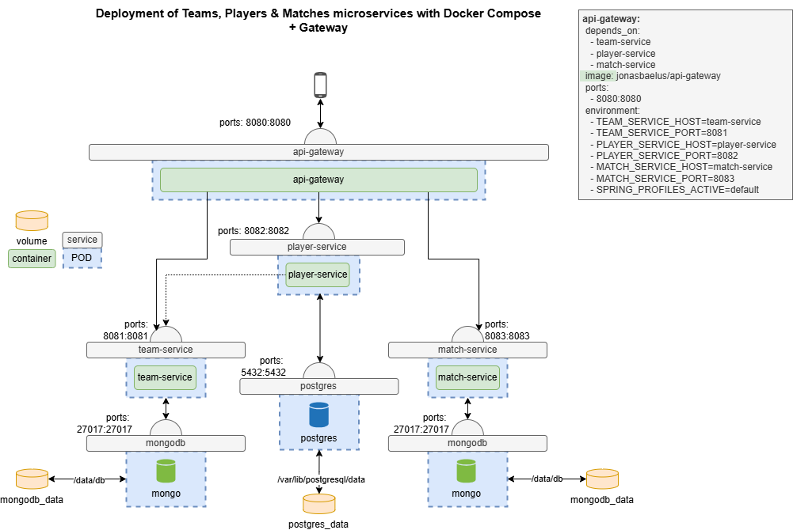
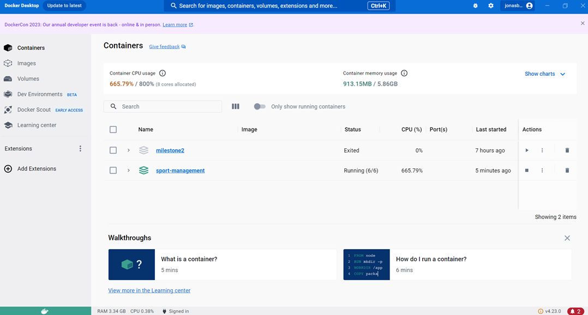
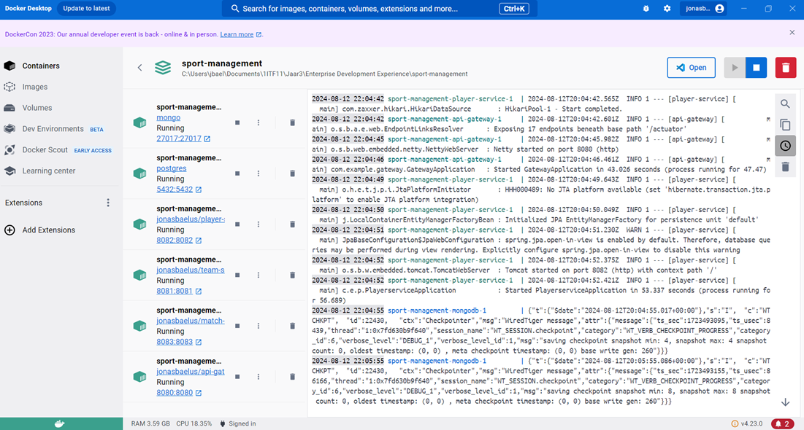
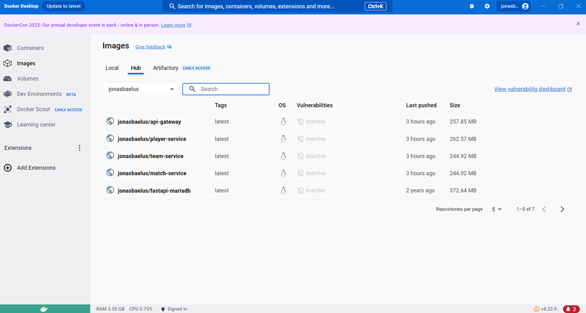
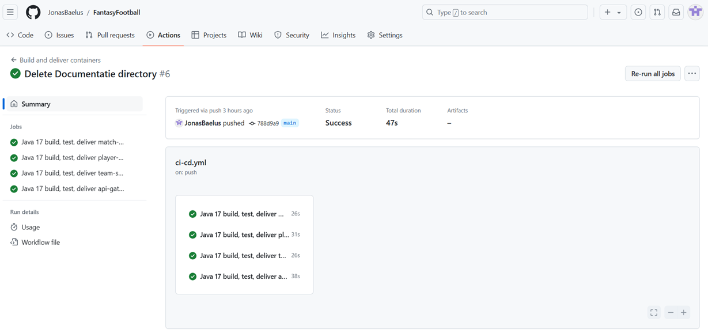
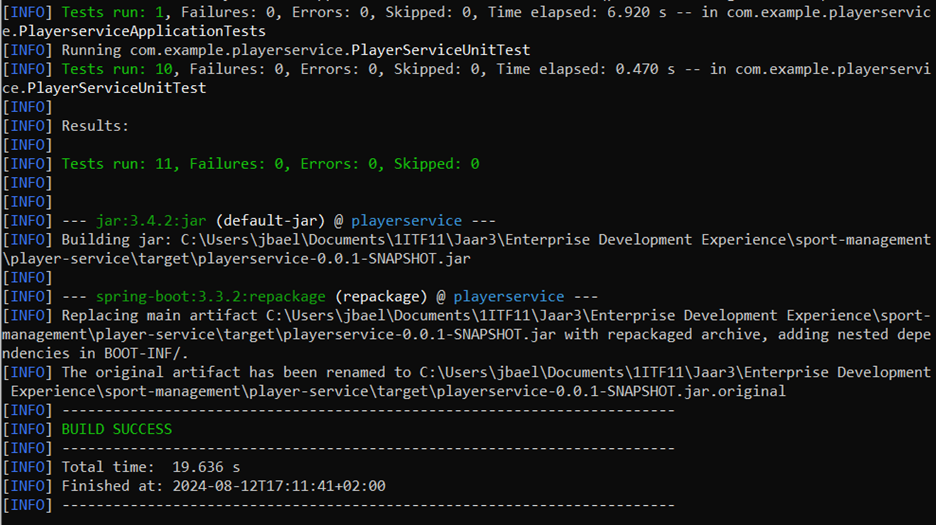
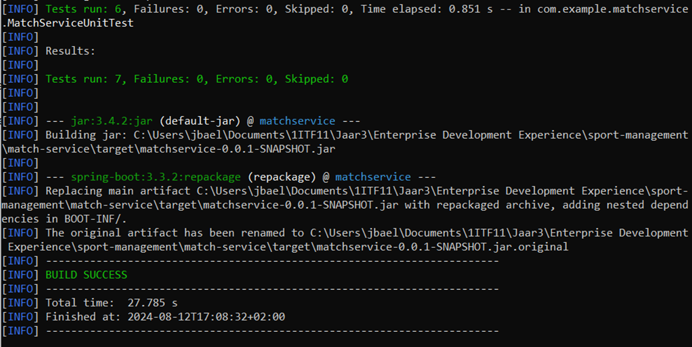
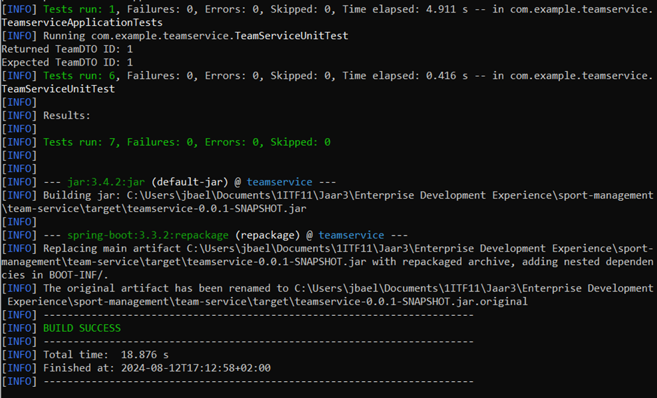

# FantasyFootball

## Beschrijving

Dit project is gebaseerd op het thema **Fantasy Football**. Hierbij kan je je eigen teams aanmaken en zelf je team samenstellen door spelers hieraan toe te voegen. 
Hierna kan je deze teams het laten uitbattelen in wedstrijden.
Het project maakt gebruik van microservices om de verschillende aspecten van het thema te beheren. De services zijn ontwikkeld met Java en Maven, en worden gedistribueerd via Docker containers.

De belangrijkste componenten van het project zijn:

- **Match Service**: Verantwoordelijk voor wedstrijdgegevens, verbonden met MongoDB.
- **Player Service**: Beheert spelergegevens en werkt samen met zowel PostgreSQL als de Team Service voor teamgerelateerde gegevens.
- **Team Service**: Behandelt CRUD-operaties voor teams. Verbonden met een MongoDB-database.
- **API Gateway**: Dient als toegangspunt voor alle verzoeken en stuurt deze door naar de juiste microservice. Zorgt ook voor de beveiliging.
- **MongoDB**: Gebruikt door de Team en Match services om gegevens op te slaan.
- **PostgreSQL**: Gebruikt door de Player service om spelergegevens op te slaan.

## Architectuurschema

Onderstaand diagram geeft een overzicht van de architectuur van het project, inclusief de microservices en de API Gateway:

## Microservices en Componenten

### Player Service
- **Beschrijving**: Behandelt alle gegevens en logica met betrekking tot spelers.
- **Belangrijkste Endpoints**:
  - `GET /players`: Haalt een lijst van alle spelers op.
  - `POST /players/create-and-update-team`: Voegt een nieuwe speler toe en voegt de ID van de nieuwe speler toe aan de lijst van playerIds van het team.
    Bij dit request wordt er dus ook een PUT-request gedaan naar de team-service om het team up te daten.
  - `GET /players/team`: Haalt een lijst van alle spelers op van 1 bepaald team.
  
### Match Service
- **Beschrijving**: Behandelt alle gegevens en logica met betrekking tot wedstrijden.
- **Belangrijkste Endpoints**:
  - `GET /matches`: Haalt een lijst van alle wedstrijden op.
  - `POST /matches`: Voegt een nieuwe wedstrijd toe.

### Team Service
- **Beschrijving**: Behandelt alle gegevens en logica met betrekking tot teams.
- **Belangrijkste Endpoints**:
  - `GET /teams`: Haalt een lijst van alle teams op.
  - `POST /teams`: Voegt een nieuw team toe.

### API Gateway
- **Beschrijving**: Biedt een centrale toegangspoort tot alle services en behandelt de routing van verzoeken.

## Aantoonbare Werking van Endpoints

Bekijk hiervoor het document 'Postman requests' in de folder 'documentatie'.

### Belangrijkste endpoint

'http://localhost:8080/players/create-and-update-team (POST)' omdat hierbij eerst een nieuwe speler wordt aangemaakt,
waarna er een request gedaan wordt naar de team-service om het team up te daten.

## Werkende Deployment

## Werkende Testen

## Uitbreidingen en Verbeteringen

### Uitbreiding: Frontend applicatie in React

Als uitbreiding op de oorspronkelijke opdracht is er een frontend ontwikkeld met React. Deze frontend biedt een gebruiksvriendelijke interface voor het beheren van teams, spelers en wedstrijden. 
De frontend communiceert met de backend microservices via de API Gateway, waardoor een naadloze interactie mogelijk is tussen de gebruiker en het systeem.

### Functionaliteiten van de Frontend:
- Lijstweergave van alle teams, spelers en wedstrijden.
- Mogelijkheid om nieuwe spelers en teams toe te voegen.
- Update- en delete-functies voor bestaande records.

### Repository Frontend ###
https://github.com/JonasBaelus/FantasyFootballFrontend

### Verbetering: MongoDB services

Momenteel maak ik gebruik van 1 MongoDB service die zowel door de team- als match-service gebruikt wordt.
Dit werkt zonder problemen, maar het is ook mogelijk om met 2 MongoDB services te werken. Beide manieren van werken hebben hun voor- en nadelen.

**Scenario 1: Eén MongoDB-service voor beide microservices**

Voordelen:

- Eenvoud: Makkelijker op te zetten en te beheren.
- Gegevensconsistentie: Beide services gebruiken dezelfde data.
- Minder resources: Lager verbruik van systeembronnen.
- Minder netwerkcomplexiteit: Geen extra netwerkconfiguratie nodig.

Nadelen:

- Geen gegevensisolatie: Data van beide services kan vermengen.
- Minder flexibiliteit: Beide services delen dezelfde databaseconfiguratie.
- Schaalbaarheid: Zware belasting op één service kan de andere beïnvloeden.

**Scenario 2: Twee aparte MongoDB-services**

Voordelen:

- Gegevensisolatie: Elke service heeft zijn eigen database.
- Flexibiliteit: Aparte configuraties voor elke service.
- Betere schaalbaarheid: Onafhankelijke schaalbaarheid per service.
- Verminderde afhankelijkheid: Problemen met één database raken de andere niet.

Nadelen:

- Complexiteit: Meer configuratie en beheer vereist.
- Meer resources: Hogere systeemvereisten.
- Duplicatie: Mogelijke gegevensduplicatie en extra opslag.

Opzich is het vrij eenvoudig om een extra service aan te maken, dus mocht je toch 2 verschillende services willen, is dit geen grote/moeilijke aanpassing.
